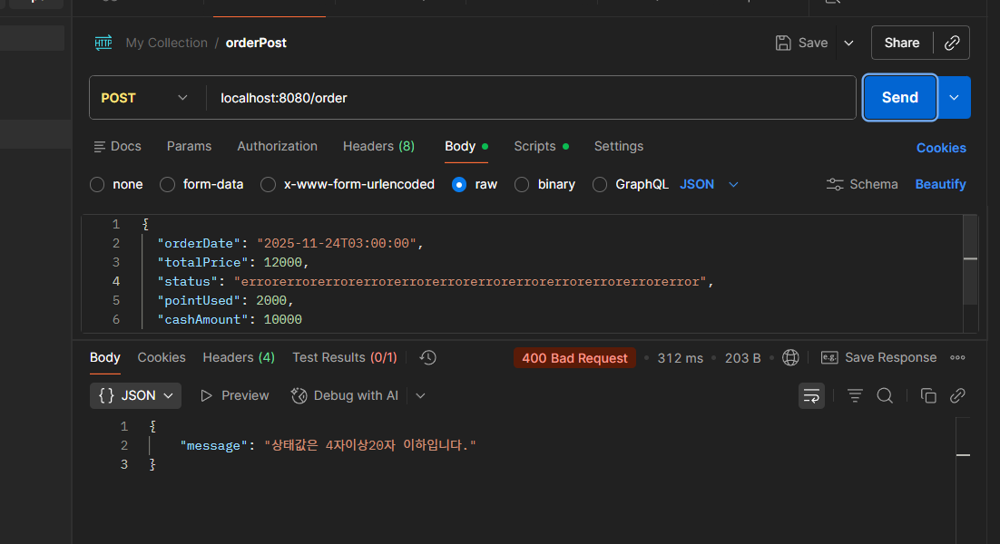
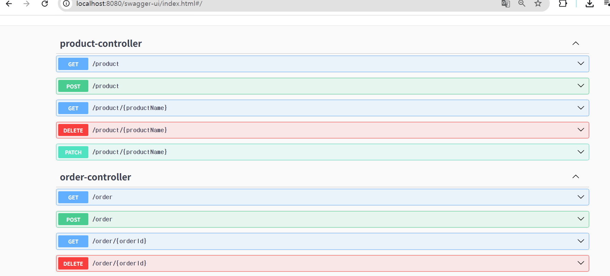

# 데이터의 무결성 보장 : DTO와 유효성 검사
## 4XX ,5XX
+ 4xx : 클라이언트 에서 잘못 요청함
+ 5xx : 서버에서 처리를 못함

# 체계적인 오류 관리 : 전역 예외 처리
1. Global Exception Handler
    + 공통 예외 처리 핸들러
    + 에러 정보 반환용 DTO
    + AOP (관점 지향 프로그래밍)
2. 커스텀 예외 처리
    + 커스텀 예외 클래스. 근데 이제 RuntimeException을 상속한
    + Global Exception Handler에 등록 -> 에러 원인 명확히 알 수 있음!

3. 에러 메시지 클래스
    + 예외 메시지 문자열 중복 사용됨 -> 추가/수정하기 힘들다.
    + 따라서 상수로 정의

## Global Exception Handler(전역 예외 핸들러)
+ Spring에서 제공.
+ 예외 종류에 따라 response를 설정 가능.
+ Global Exception을 처리 = 스프링 애플리케이션 전역의 모든 에러 처리 방법을 결정

A타입 에러 발생?  
-> 해당 에러 타입을 다루는 핸들러가 Controller 메서드 대신 Response Body를 생성 & 응답

`@ControllerAdvice`란?  
모든 컨트롤러에서 발생하는 예외를 중앙에서 처리

> AOP vs OOP
> AOP = 부가 기능 모듈화

# 협업을 위한 API 명세 : Swagger(OpenAPI)

.